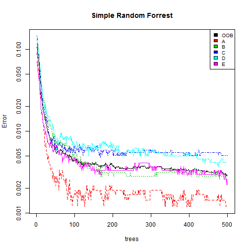
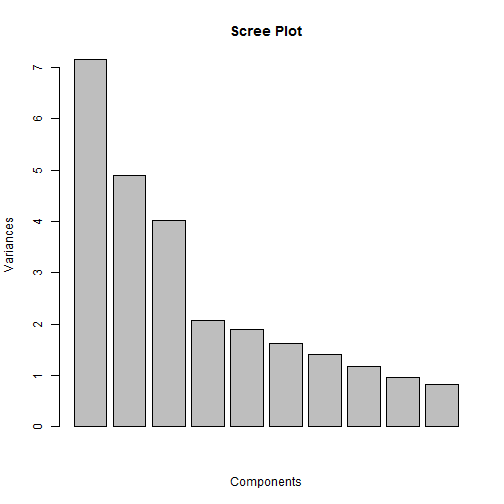
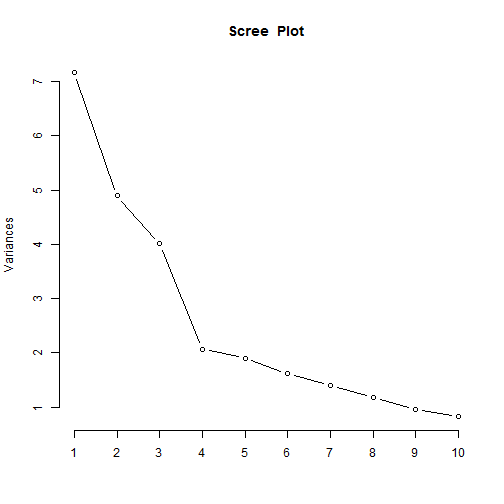
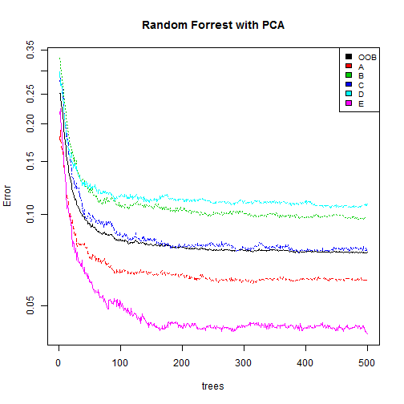

<!-- rmarkdown v1 -->
Activity Analysis
========================================================

## Executive Summary
The analysis is about classifying activities based on a number of factors. For the classification problem we will compare three algorithms:
1. Random Forest
2. Random Forest with Bagging
3. Random Forest after Dimension Rediuction
  
Dimension Reduction with Principal Component Analysis, dramatically reduces the complexity and reduces the execution time. However; the algorith compromises on the accuracy and interpretability.

1. Data used for training and testing - [Training](https://d396qusza40orc.cloudfront.net/predmachlearn/pml-training.csv)
2. Data for Prediction - [Validation](https://d396qusza40orc.cloudfront.net/predmachlearn/pml-testing.csv)

## Loading the Libraries
First, we will load all the required libraries needed. We would use **caret** and **party** package for the analysis.


```r
library(caret)
```

```
## Warning: package 'caret' was built under R version 3.1.1
```

```
## Loading required package: lattice
## Loading required package: ggplot2
```

```r
library(randomForest)
```

```
## Warning: package 'randomForest' was built under R version 3.1.1
```

```
## randomForest 4.6-10
## Type rfNews() to see new features/changes/bug fixes.
```

```r
library(party)
```

```
## Warning: package 'party' was built under R version 3.1.1
```

```
## Loading required package: grid
## Loading required package: zoo
## 
## Attaching package: 'zoo'
## 
## The following objects are masked from 'package:base':
## 
##     as.Date, as.Date.numeric
## 
## Loading required package: sandwich
```

```
## Warning: package 'sandwich' was built under R version 3.1.1
```

```
## Loading required package: strucchange
```

```
## Warning: package 'strucchange' was built under R version 3.1.1
```

```
## Loading required package: modeltools
```

```
## Warning: package 'modeltools' was built under R version 3.1.1
```

```
## Loading required package: stats4
```


```
## Error: cannot change working directory
```


## Importing the Datasets

```r
PML_Training<-read.csv("pml_training.csv",header=T)

PML_Testing<-read.csv("pml_testing.csv",header=T)
```
## Data Preprocessing
Through some preliminary analysis, we would first select the columns which are expected to influence the prediction.

We would store the index of these columns in a new variable **columns**

```r
columns<-which(names(PML_Training) %in% c("classe",
                                          "num_window",
                                          "roll_belt",
                                          "pitch_belt",
                                          "yaw_belt",
                                          "total_accel_belt",
                                          "gyros_belt_x",
                                          "gyros_belt_y",
                                          "gyros_belt_z",
                                          "accel_belt_x",
                                          "accel_belt_y",
                                          "accel_belt_z",
                                          "magnet_belt_x",
                                          "magnet_belt_y",
                                          "magnet_belt_z",
                                          "roll_arm",
                                          "pitch_arm",
                                          "yaw_arm",
                                          "total_accel_arm",
                                          "gyros_arm_x",
                                          "gyros_arm_y",
                                          "gyros_arm_z",
                                          "accel_arm_x",
                                          "accel_arm_y",
                                          "accel_arm_z",
                                          "magnet_arm_x",
                                          "magnet_arm_y",
                                          "magnet_arm_z",
                                          "roll_dumbbell",
                                          "pitch_dumbbell",
                                          "yaw_dumbbell"))
```
The columns use for the algorith are as follows:
7, 8, 9, 10, 11, 37, 38, 39, 40, 41, 42, 43, 44, 45, 46, 47, 48, 49, 60, 61, 62, 63, 64, 65, 66, 67, 68, 84, 85, 86, 160

We will then subset the training set and partition it into training and testing sets.

```r
PML_Training_Subset<-PML_Training[,columns]
```

Training set will contain 75% of the records and testing set will contain 25% of the records.

```r
inTrain<-createDataPartition(y=PML_Training_Subset$classe,p=0.75,list=FALSE)
training<-PML_Training_Subset[inTrain,]
testing<-PML_Training_Subset[-inTrain,]
```

## Simple Random Forrest
**Step 1: Training The Model**
We will first train the model on the training set using all the predictors. The output variable is **classe**

```r
r2 = randomForest(classe ~., data=training, importance=TRUE, do.trace=100)
```

```
## ntree      OOB      1      2      3      4      5
##   100:   0.37%  0.12%  0.28%  0.55%  0.79%  0.30%
##   200:   0.35%  0.12%  0.18%  0.55%  0.75%  0.37%
##   300:   0.35%  0.10%  0.14%  0.66%  0.70%  0.37%
##   400:   0.33%  0.12%  0.07%  0.62%  0.62%  0.37%
##   500:   0.31%  0.10%  0.07%  0.62%  0.54%  0.37%
```
**Step 2: FOt the Model on the Training Set:**

```r
pred2<-predict(r2,testing[,-31])
```
**Step 3: Building the Confusion Matrix to asses the accuracy of the Model**

```r
r2
```

```
## 
## Call:
##  randomForest(formula = classe ~ ., data = training, importance = TRUE,      do.trace = 100) 
##                Type of random forest: classification
##                      Number of trees: 500
## No. of variables tried at each split: 5
## 
##         OOB estimate of  error rate: 0.31%
## Confusion matrix:
##      A    B    C    D    E class.error
## A 4181    0    1    3    0   0.0009558
## B    1 2846    1    0    0   0.0007022
## C    0   14 2551    2    0   0.0062330
## D    0    0   12 2399    1   0.0053897
## E    0    2    1    7 2696   0.0036955
```

```r
confusionMatrix(testing$classe,pred2)
```

```
## Warning: package 'e1071' was built under R version 3.1.1
```

```
## Confusion Matrix and Statistics
## 
##           Reference
## Prediction    A    B    C    D    E
##          A 1393    1    0    1    0
##          B    0  946    0    3    0
##          C    0    4  849    1    1
##          D    1    0    4  799    0
##          E    0    0    0    0  901
## 
## Overall Statistics
##                                         
##                Accuracy : 0.997         
##                  95% CI : (0.995, 0.998)
##     No Information Rate : 0.284         
##     P-Value [Acc > NIR] : <2e-16        
##                                         
##                   Kappa : 0.996         
##  Mcnemar's Test P-Value : NA            
## 
## Statistics by Class:
## 
##                      Class: A Class: B Class: C Class: D Class: E
## Sensitivity             0.999    0.995    0.995    0.994    0.999
## Specificity             0.999    0.999    0.999    0.999    1.000
## Pos Pred Value          0.999    0.997    0.993    0.994    1.000
## Neg Pred Value          1.000    0.999    0.999    0.999    1.000
## Prevalence              0.284    0.194    0.174    0.164    0.184
## Detection Rate          0.284    0.193    0.173    0.163    0.184
## Detection Prevalence    0.284    0.194    0.174    0.164    0.184
## Balanced Accuracy       0.999    0.997    0.997    0.996    0.999
```
OOB estimate of  error rate = 0.26%.
Accuracy of the model = 99.76%

**Plot of the Error Rate vs Number of Trees used**

```r
plot(r2, log="y",main="Simple Random Forrest")
legend("topright", colnames(r2$err.rate),col=1:6,cex=0.8,fill=1:6)
```

 
The above plot shows that classifying **Activity Type D** has highest error rate.

**Importance of Variables**

```r
VariableUsed<-varUsed(r2, by.tree=FALSE, count=TRUE)
Max_Imp=names(PML_Training_Subset)[which(VariableUsed==max(VariableUsed))]
Min_Imp=names(PML_Training_Subset)[which(VariableUsed==min(VariableUsed))]
```
Variable Used the most **num_window**
Variable used the least **total_accel_belt**

## Random Forrest with Bagging

```r
predictors<-PML_Training_Subset[,-31]
Classe<-PML_Training_Subset[,31]
treeBag<-bag(predictors,Classe,B=10,
             bagControl=bagControl(fit=ctreeBag$fit,
                                   predict=ctreeBag$pred,
                                   aggregate=ctreeBag$aggregate))


pred3<-predict(treeBag,testing[,-31])

confusionMatrix(testing$classe,pred3)
```

```
## Confusion Matrix and Statistics
## 
##           Reference
## Prediction    A    B    C    D    E
##          A 1380   10    3    1    1
##          B   10  920   14    3    2
##          C    6   12  834    1    2
##          D    2    2   26  772    2
##          E    0    3    0    2  896
## 
## Overall Statistics
##                                         
##                Accuracy : 0.979         
##                  95% CI : (0.975, 0.983)
##     No Information Rate : 0.285         
##     P-Value [Acc > NIR] : < 2e-16       
##                                         
##                   Kappa : 0.974         
##  Mcnemar's Test P-Value : 0.00178       
## 
## Statistics by Class:
## 
##                      Class: A Class: B Class: C Class: D Class: E
## Sensitivity             0.987    0.971    0.951    0.991    0.992
## Specificity             0.996    0.993    0.995    0.992    0.999
## Pos Pred Value          0.989    0.969    0.975    0.960    0.994
## Neg Pred Value          0.995    0.993    0.989    0.998    0.998
## Prevalence              0.285    0.193    0.179    0.159    0.184
## Detection Rate          0.281    0.188    0.170    0.157    0.183
## Detection Prevalence    0.284    0.194    0.174    0.164    0.184
## Balanced Accuracy       0.991    0.982    0.973    0.992    0.995
```
Confusion Matrix of the bagged model shows accuracy of 98.06%

## Random Forrest with PCA
**Step 1:**
Create Principal Components and determine the number of components to be use

```r
prComp<-prcomp(training[,-31],center=T,scale=T)
```
We will now calculate Eigen Values and components with eigen value greater than one will be used.

```r
Eigen_Values=prComp$sdev^2
Eigen_Values
```

```
##  [1] 7.164588 4.896200 4.018763 2.066795 1.899472 1.622989 1.402488
##  [8] 1.177047 0.963959 0.823242 0.703494 0.648525 0.479894 0.368907
## [15] 0.326597 0.295824 0.269906 0.218827 0.168478 0.129478 0.087554
## [22] 0.061008 0.046543 0.037563 0.035236 0.032277 0.024807 0.020321
## [29] 0.006877 0.002342
```

```r
No_of_comp=sum(Eigen_Values>1)
```
Eigen Value calculation shows that we should use **8** components.

We will also create screeplot to see after how many components variance plot flattens


```r
screeplot(prComp,main="Scree Plot",xlab="Components")
```

 

```r
screeplot(prComp,type="line",main="Scree  Plot")
```

 
The Plot shows that after 10 components, variance flattens.

We will take the middle path and go with 9 components.

Varimax Rotation shows loading of different variables on these components

```r
summary(prComp)
```

```
## Importance of components:
##                          PC1   PC2   PC3    PC4    PC5    PC6    PC7
## Standard deviation     2.677 2.213 2.005 1.4376 1.3782 1.2740 1.1843
## Proportion of Variance 0.239 0.163 0.134 0.0689 0.0633 0.0541 0.0467
## Cumulative Proportion  0.239 0.402 0.536 0.6049 0.6682 0.7223 0.7690
##                           PC8    PC9   PC10   PC11   PC12  PC13   PC14
## Standard deviation     1.0849 0.9818 0.9073 0.8387 0.8053 0.693 0.6074
## Proportion of Variance 0.0392 0.0321 0.0274 0.0234 0.0216 0.016 0.0123
## Cumulative Proportion  0.8083 0.8404 0.8679 0.8913 0.9129 0.929 0.9412
##                          PC15    PC16  PC17    PC18    PC19    PC20
## Standard deviation     0.5715 0.54390 0.520 0.46779 0.41046 0.35983
## Proportion of Variance 0.0109 0.00986 0.009 0.00729 0.00562 0.00432
## Cumulative Proportion  0.9521 0.96196 0.971 0.97825 0.98387 0.98818
##                           PC21    PC22    PC23    PC24    PC25    PC26
## Standard deviation     0.29589 0.24700 0.21574 0.19381 0.18771 0.17966
## Proportion of Variance 0.00292 0.00203 0.00155 0.00125 0.00117 0.00108
## Cumulative Proportion  0.99110 0.99313 0.99469 0.99594 0.99711 0.99819
##                           PC27    PC28    PC29    PC30
## Standard deviation     0.15750 0.14255 0.08293 0.04840
## Proportion of Variance 0.00083 0.00068 0.00023 0.00008
## Cumulative Proportion  0.99902 0.99969 0.99992 1.00000
```

```r
load = prComp$rotation
my.var=varimax(load)
my.var
```

```
## $loadings
## 
## Loadings:
##                  PC1 PC2 PC3 PC4 PC5 PC6 PC7 PC8 PC9 PC10 PC11 PC12 PC13
## num_window                                       -1                     
## roll_belt                                                               
## pitch_belt                                                              
## yaw_belt                                                                
## total_accel_belt                                                        
## gyros_belt_x                                          1                 
## gyros_belt_y                                                            
## gyros_belt_z                             -1                             
## accel_belt_x          1                                                 
## accel_belt_y                                                            
## accel_belt_z                                                            
## magnet_belt_x                                                           
## magnet_belt_y                    -1                                     
## magnet_belt_z                                                           
## roll_arm                                                                
## pitch_arm                                                           -1  
## yaw_arm                                                    1            
## total_accel_arm                      -1                                 
## gyros_arm_x                   1                                         
## gyros_arm_y                                                             
## gyros_arm_z                                                             
## accel_arm_x                                                             
## accel_arm_y       1                                                     
## accel_arm_z                                                             
## magnet_arm_x                                                            
## magnet_arm_y                                                            
## magnet_arm_z              1                                             
## roll_dumbbell                                                   1       
## pitch_dumbbell                               -1                         
## yaw_dumbbell                                                            
##                  PC14 PC15 PC16 PC17 PC18 PC19 PC20 PC21 PC22 PC23 PC24
## num_window                                                             
## roll_belt                                                              
## pitch_belt                                                             
## yaw_belt                                                               
## total_accel_belt                                                       
## gyros_belt_x                                                           
## gyros_belt_y                               1                           
## gyros_belt_z                                                           
## accel_belt_x                                                           
## accel_belt_y                                                   1       
## accel_belt_z                                                           
## magnet_belt_x                                        1                 
## magnet_belt_y                                                          
## magnet_belt_z                         1                                
## roll_arm               1                                               
## pitch_arm                                                              
## yaw_arm                                                                
## total_accel_arm                                                        
## gyros_arm_x                                                            
## gyros_arm_y                                              -1            
## gyros_arm_z      -1                                                    
## accel_arm_x                                                         1  
## accel_arm_y                                                            
## accel_arm_z                                                            
## magnet_arm_x               -1                                          
## magnet_arm_y                                    1                      
## magnet_arm_z                                                           
## roll_dumbbell                                                          
## pitch_dumbbell                                                         
## yaw_dumbbell                     1                                     
##                  PC25 PC26 PC27 PC28 PC29 PC30
## num_window                                    
## roll_belt                                  1  
## pitch_belt                 -1                 
## yaw_belt          1                           
## total_accel_belt                -1            
## gyros_belt_x                                  
## gyros_belt_y                                  
## gyros_belt_z                                  
## accel_belt_x                                  
## accel_belt_y                                  
## accel_belt_z                          1       
## magnet_belt_x                                 
## magnet_belt_y                                 
## magnet_belt_z                                 
## roll_arm                                      
## pitch_arm                                     
## yaw_arm                                       
## total_accel_arm                               
## gyros_arm_x                                   
## gyros_arm_y                                   
## gyros_arm_z                                   
## accel_arm_x                                   
## accel_arm_y                                   
## accel_arm_z           -1                      
## magnet_arm_x                                  
## magnet_arm_y                                  
## magnet_arm_z                                  
## roll_dumbbell                                 
## pitch_dumbbell                                
## yaw_dumbbell                                  
## 
##                  PC1   PC2   PC3   PC4   PC5   PC6   PC7   PC8   PC9  PC10
## SS loadings    1.000 1.000 1.000 1.000 1.000 1.000 1.000 1.000 1.000 1.000
## Proportion Var 0.033 0.033 0.033 0.033 0.033 0.033 0.033 0.033 0.033 0.033
## Cumulative Var 0.033 0.067 0.100 0.133 0.167 0.200 0.233 0.267 0.300 0.333
##                 PC11  PC12  PC13  PC14  PC15  PC16  PC17  PC18  PC19  PC20
## SS loadings    1.000 1.000 1.000 1.000 1.000 1.000 1.000 1.000 1.000 1.000
## Proportion Var 0.033 0.033 0.033 0.033 0.033 0.033 0.033 0.033 0.033 0.033
## Cumulative Var 0.367 0.400 0.433 0.467 0.500 0.533 0.567 0.600 0.633 0.667
##                 PC21  PC22  PC23  PC24  PC25  PC26  PC27  PC28  PC29  PC30
## SS loadings    1.000 1.000 1.000 1.000 1.000 1.000 1.000 1.000 1.000 1.000
## Proportion Var 0.033 0.033 0.033 0.033 0.033 0.033 0.033 0.033 0.033 0.033
## Cumulative Var 0.700 0.733 0.767 0.800 0.833 0.867 0.900 0.933 0.967 1.000
## 
## $rotmat
##             [,1]       [,2]      [,3]      [,4]     [,5]       [,6]
##  [1,]  0.3040484 -0.2060639  0.009974 -0.050233 -0.04187 -0.1093807
##  [2,]  0.1368716  0.2905509  0.137559  0.049023 -0.16861 -0.0409137
##  [3,]  0.1628888 -0.1127924  0.435419 -0.022167  0.05644  0.1139501
##  [4,] -0.0536081 -0.2433279 -0.001651  0.464838 -0.31495 -0.0886735
##  [5,]  0.0941386  0.1344642  0.017967  0.481399  0.40171  0.0280420
##  [6,]  0.1371141  0.0474891  0.193515  0.087486 -0.23298  0.5713966
##  [7,] -0.0008985  0.0760982 -0.120088  0.095182 -0.18281 -0.3011907
##  [8,]  0.0542221  0.0338713 -0.072643  0.057177 -0.20470 -0.0002667
##  [9,]  0.0494666 -0.0295826  0.036291  0.071821  0.10882  0.1422545
## [10,]  0.0922655  0.0005979  0.019420  0.050034  0.20972  0.1269265
## [11,] -0.0005016 -0.0497300  0.036806 -0.039749  0.04406  0.0789299
## [12,]  0.1252481 -0.0338294 -0.078538  0.051747 -0.01773 -0.1599165
## [13,]  0.0783276  0.1660308  0.036428  0.048209 -0.06603 -0.0657483
## [14,] -0.0555150  0.0535147 -0.036835  0.176499  0.02697 -0.0734058
## [15,] -0.0366835 -0.2127095 -0.058928  0.051371  0.13798  0.0239990
## [16,] -0.2473620  0.0101660 -0.097703  0.093408 -0.19083  0.4694295
## [17,] -0.1444586  0.0530578 -0.090445  0.012377  0.09123  0.3745675
## [18,] -0.0479757 -0.1096949 -0.136076 -0.049332  0.34251  0.2178537
## [19,]  0.0743541 -0.0746619 -0.001631  0.041144  0.41130 -0.0101482
## [20,]  0.3596865 -0.0795516 -0.320974 -0.007780 -0.26068  0.2349619
## [21,] -0.3032676 -0.1149719  0.395288  0.092606 -0.21149 -0.0672747
## [22,]  0.0423013 -0.0662467 -0.105059 -0.575949 -0.10345  0.0201632
## [23,] -0.0479419  0.5330175 -0.065669 -0.063256  0.11575  0.0057541
## [24,] -0.0299414 -0.0293661  0.088749 -0.314515  0.08705  0.0124936
## [25,]  0.3540120 -0.1773036 -0.325790  0.134603  0.01389  0.0127470
## [26,] -0.0283351 -0.1429965  0.402706 -0.024364  0.06014  0.0004111
## [27,] -0.0632713 -0.5011950  0.031740 -0.047446  0.09638 -0.0108139
## [28,] -0.3185266 -0.2427975 -0.260962  0.034859 -0.01926 -0.0039156
## [29,] -0.4936010  0.0477656 -0.249199  0.016014  0.01238 -0.0150818
## [30,]  0.0123584 -0.0004341  0.016566 -0.005639  0.07106  0.0012887
##             [,7]      [,8]       [,9]     [,10]      [,11]      [,12]
##  [1,] -0.1150338 -0.021456  0.0592889 -0.052656  0.1180396 -0.0141471
##  [2,] -0.2165670  0.213571 -0.0874146  0.280415 -0.0582387  0.1746349
##  [3,]  0.1087156  0.008586  0.0333713 -0.153970  0.0354821 -0.1151949
##  [4,] -0.0749509  0.073283 -0.1310657  0.018255 -0.1649310 -0.0518378
##  [5,] -0.0903155 -0.110415  0.0989621  0.008400  0.2580263 -0.0438516
##  [6,]  0.0147320 -0.184458 -0.0438214 -0.026816  0.1103444  0.2715367
##  [7,]  0.4402652 -0.223090  0.3002585 -0.212461 -0.0540810  0.3548052
##  [8,]  0.1182160  0.602330 -0.0385713 -0.267820  0.2552309 -0.4580916
##  [9,] -0.1595359  0.204521  0.6861877 -0.086922 -0.4715512 -0.0417334
## [10,]  0.4079643  0.179006 -0.4746396  0.116484 -0.3361983  0.0952492
## [11,]  0.2444114  0.059934  0.3584241  0.342015  0.4905375 -0.0333900
## [12,] -0.1929027  0.067190 -0.1360912 -0.430395  0.2921456  0.4414377
## [13,] -0.0108559 -0.132759 -0.0244402 -0.196630 -0.3316355 -0.2053436
## [14,] -0.0584208 -0.116078 -0.0502668  0.328979  0.1154926 -0.1841627
## [15,] -0.0238964  0.288620  0.0579465  0.334800 -0.1042669  0.3831605
## [16,]  0.2160822 -0.197431  0.0285705 -0.089459  0.0466608 -0.0885661
## [17,] -0.0722014  0.414763  0.0252101 -0.211327  0.0354085  0.2573471
## [18,] -0.3931000 -0.254997 -0.1129082 -0.181973 -0.0127259 -0.1301379
## [19,]  0.4433706  0.005622 -0.0118765 -0.213797 -0.0124531 -0.0559420
## [20,]  0.0722243 -0.108477  0.0326801  0.142274 -0.0829646 -0.1211229
## [21,] -0.0337042 -0.024327  0.0052409 -0.099883  0.0162916  0.0266571
## [22,] -0.0348401 -0.021832  0.0248921 -0.079032  0.0230491 -0.0036229
## [23,] -0.0047177  0.047442  0.0198862 -0.010150  0.0062319  0.0173085
## [24,]  0.0342187  0.035111 -0.0297001  0.136937 -0.0135503  0.0305403
## [25,] -0.0258783  0.006736 -0.0032420 -0.035545  0.0091370  0.0322968
## [26,] -0.0148746 -0.013773 -0.0002479 -0.057691 -0.0078799 -0.0007348
## [27,]  0.0175470  0.012772 -0.0087748  0.051159  0.0052420 -0.0066474
## [28,] -0.0169498  0.022789 -0.0127928  0.005998  0.0027965  0.0155602
## [29,]  0.0074134 -0.003550 -0.0008194 -0.021627  0.0017297 -0.0123223
## [30,]  0.0000959  0.002308 -0.0015517 -0.007838  0.0005872  0.0044940
##           [,13]      [,14]     [,15]     [,16]     [,17]     [,18]
##  [1,]  0.023009  0.2603088  0.171593  0.060700  0.091081 -0.022774
##  [2,] -0.155706 -0.0464163 -0.104661  0.159687 -0.341265  0.167914
##  [3,] -0.296464  0.0544152 -0.033729  0.347869  0.079517 -0.054356
##  [4,]  0.038079 -0.2365114 -0.184560  0.056049  0.079656  0.311838
##  [5,] -0.024986 -0.1066317  0.273493  0.037827  0.015928 -0.384750
##  [6,]  0.110374  0.0593087  0.121322 -0.356573  0.021818  0.240131
##  [7,] -0.206373  0.0420321  0.090784  0.119955 -0.017928  0.206102
##  [8,] -0.037145  0.1176381  0.187400 -0.104889 -0.232345  0.099442
##  [9,] -0.046782  0.0930233 -0.285986 -0.152386 -0.155716 -0.121169
## [10,]  0.071310  0.0070706 -0.271054 -0.082482 -0.116510 -0.269077
## [11,]  0.449203 -0.1919913 -0.331617  0.064352 -0.072931  0.101252
## [12,]  0.173034  0.2096675 -0.387230 -0.018717 -0.212848 -0.220264
## [13,]  0.724962  0.2275246  0.134833  0.205332  0.096404  0.042642
## [14,] -0.167656  0.7196333 -0.324270 -0.042100  0.244617  0.130673
## [15,]  0.128939  0.2982864  0.486852  0.061159 -0.209903  0.088728
## [16,] -0.079504  0.2525431  0.010595  0.255701 -0.368102 -0.173660
## [17,] -0.012134 -0.0065601 -0.058967  0.265026  0.593846  0.082460
## [18,] -0.033478 -0.0753950 -0.073460  0.135644 -0.302170  0.394380
## [19,] -0.020062  0.0683724 -0.048310 -0.086366 -0.055439  0.363677
## [20,] -0.061080 -0.0963722 -0.008943  0.029423  0.104434 -0.220974
## [21,]  0.075040  0.0203496 -0.011087  0.156734 -0.083096 -0.172300
## [22,] -0.026413  0.0807261 -0.002160 -0.137159  0.014563 -0.071826
## [23,] -0.006564  0.0090711  0.014736 -0.064030 -0.007762  0.125635
## [24,]  0.024948 -0.0045607 -0.027595  0.406874 -0.047237  0.014216
## [25,] -0.012005 -0.0209218 -0.045382  0.061608 -0.028470  0.005532
## [26,]  0.006485  0.0399861  0.033056 -0.450017  0.044727 -0.018935
## [27,]  0.029623  0.0016174 -0.005295  0.046240 -0.003129  0.026941
## [28,]  0.001321 -0.0006325  0.015424 -0.118509  0.001246 -0.051705
## [29,]  0.003945 -0.0033519  0.004920 -0.112401  0.015121 -0.107823
## [30,]  0.003190  0.0012525  0.006705 -0.002771  0.002281  0.024051
##           [,19]     [,20]     [,21]     [,22]      [,23]     [,24]
##  [1,] -0.228132  0.032347 -0.226319 -0.122936 -0.2842506 -0.055096
##  [2,]  0.129129  0.147566  0.258003  0.015161 -0.2305196 -0.313783
##  [3,] -0.055211  0.438060 -0.073191 -0.029352  0.1353989 -0.268757
##  [4,]  0.070048  0.068690 -0.231006  0.451976  0.0707363 -0.043667
##  [5,] -0.034990  0.006997  0.128605  0.449390 -0.0829314 -0.006005
##  [6,] -0.046125 -0.028669  0.018428  0.102364 -0.0610156  0.190891
##  [7,] -0.378353  0.093212  0.125799  0.106980 -0.0070723  0.075229
##  [8,] -0.173197  0.018846  0.083575  0.066650  0.0140104  0.190909
##  [9,] -0.015343 -0.042908 -0.035953  0.058828 -0.0506866  0.110464
## [10,] -0.419579 -0.014374  0.011404  0.063257 -0.0622279  0.007786
## [11,] -0.178502  0.079658  0.017092 -0.029299  0.0004735 -0.137712
## [12,]  0.181138  0.187283 -0.040583  0.024938  0.0471183  0.131275
## [13,]  0.011454  0.158303  0.083307  0.046169 -0.0289964 -0.135203
## [14,] -0.056120 -0.035193  0.133972  0.102958  0.0497689  0.070407
## [15,]  0.031456  0.094833  0.033721  0.019177  0.1707631 -0.037679
## [16,]  0.147706 -0.105909 -0.295877  0.009525 -0.0161363 -0.191187
## [17,] -0.060939 -0.064674  0.109755 -0.026975 -0.0581541 -0.092514
## [18,] -0.381947  0.092916  0.210476 -0.030623  0.0203925  0.064023
## [19,]  0.526937 -0.051685  0.240059  0.015045 -0.1159115 -0.066575
## [20,]  0.166281  0.381804  0.415537 -0.069690  0.1673346  0.217972
## [21,] -0.060243 -0.330500  0.530304 -0.077077  0.2585253  0.056495
## [22,] -0.040593 -0.110566  0.166577  0.633128 -0.0002325 -0.362386
## [23,] -0.027136  0.163761 -0.209432  0.048538  0.5924783  0.016760
## [24,]  0.111937  0.026201 -0.108024  0.313327  0.0460269  0.526274
## [25,] -0.040649 -0.359524 -0.004251 -0.104360  0.4404285 -0.327371
## [26,] -0.035489  0.244450 -0.004747  0.002597  0.2251517 -0.138563
## [27,]  0.051274  0.060099 -0.065924  0.048375  0.2258275  0.094836
## [28,] -0.027634  0.310910  0.073434 -0.040373 -0.1689998 -0.086790
## [29,] -0.001519  0.284766  0.062700 -0.010182  0.0308190 -0.129736
## [30,] -0.005020 -0.008291 -0.044892  0.004603  0.0090094 -0.004995
##           [,25]     [,26]     [,27]     [,28]     [,29]     [,30]
##  [1,] -0.345611  0.094980 -0.191936  0.327330  0.332973 -0.343254
##  [2,]  0.070091  0.055256  0.298576  0.158067  0.165639 -0.137303
##  [3,]  0.005468 -0.379835 -0.111041 -0.110003 -0.105761  0.096562
##  [4,] -0.134805  0.080275 -0.241838 -0.008669  0.027041 -0.011080
##  [5,]  0.010252  0.015027  0.106035  0.059873  0.011485 -0.040474
##  [6,]  0.022029 -0.378120  0.081675  0.054090  0.069233 -0.052888
##  [7,]  0.111078  0.112566  0.136806 -0.018250  0.012255  0.008278
##  [8,]  0.092353 -0.028188  0.074808 -0.037891  0.005155  0.021596
##  [9,] -0.034101 -0.091158 -0.011978  0.028895  0.024727 -0.029787
## [10,] -0.090177 -0.009589 -0.021103  0.032635  0.034651 -0.049437
## [11,] -0.027539  0.037534 -0.081173 -0.019275 -0.008615  0.007514
## [12,] -0.014226  0.004500 -0.038504 -0.093612 -0.042482  0.053220
## [13,]  0.120683 -0.036928  0.161460  0.002976 -0.016570  0.018929
## [14,]  0.062663 -0.019515  0.035656 -0.034864 -0.037289  0.046496
## [15,] -0.054838  0.019911 -0.250325 -0.196645 -0.115496  0.110629
## [16,]  0.002453  0.312681  0.030070  0.041536  0.002183 -0.002667
## [17,]  0.030659  0.236247  0.071144  0.020106  0.016809 -0.029513
## [18,] -0.016197  0.133974 -0.100493 -0.080879 -0.028725  0.006212
## [19,] -0.133613 -0.004207 -0.124316  0.118492  0.074851 -0.113839
## [20,] -0.121989  0.216059 -0.103736 -0.030663  0.068912  0.004996
## [21,] -0.237445 -0.045426 -0.154523  0.201003  0.075164 -0.047678
## [22,] -0.131527 -0.008978 -0.041194 -0.052102 -0.041517  0.046306
## [23,] -0.391579  0.011724  0.033259  0.287313 -0.017399 -0.077064
## [24,]  0.385050 -0.051374 -0.104989  0.298345  0.134906 -0.141050
## [25,]  0.396215 -0.224139 -0.005791  0.203911  0.092322 -0.088903
## [26,]  0.407082  0.517921 -0.042170  0.146504  0.072709 -0.086786
## [27,] -0.226975 -0.002184  0.745528 -0.104412  0.121997 -0.138126
## [28,]  0.027028 -0.201041  0.070660  0.649713 -0.321046  0.199472
## [29,]  0.136478 -0.293661 -0.137653 -0.226035  0.514783 -0.351132
## [30,] -0.037821  0.016676  0.027552  0.104858  0.625998  0.765623
```
Cumulative variance equals 1, if we use al the 30 components. However, we decide to use 9 components.

**Step 2: Pre-processing to Compute Components**

```r
preProc<-preProcess(training[,-31],method="pca",pcaComp=9)
```

**Step 3: Train the PCA Model on Train set and apply on Test set**

```r
trainPC<-predict(preProc,training[,-31])
testPC<-predict(preProc,testing[,-31])
```

**Step 4: Fit Random Forest on trainPC**

```r
r = randomForest(training$classe ~., data=trainPC, importance=TRUE, do.trace=100)
```

```
## ntree      OOB      1      2      3      4      5
##   100:   8.28%  6.48% 10.81%  8.61% 11.57%  5.14%
##   200:   7.81%  6.38% 10.36%  7.87% 11.28%  4.21%
##   300:   7.63%  6.07% 10.11%  7.75% 11.03%  4.29%
##   400:   7.57%  6.14%  9.83%  7.60% 11.11%  4.21%
##   500:   7.51%  6.12%  9.83%  7.71% 10.86%  4.03%
```

**Step 5: Fit the trained model on training set**

```r
pred<-predict(r,testPC)
```
We will now construct the Confusion Matrix to assess the accuracy of the Model

```r
confusionMatrix(testing$classe,pred)
```

```
## Confusion Matrix and Statistics
## 
##           Reference
## Prediction    A    B    C    D    E
##          A 1317   40   14   21    3
##          B   33  865   38    9    4
##          C   22   23  791   14    5
##          D   13   13   52  720    6
##          E    3   16    4   17  861
## 
## Overall Statistics
##                                         
##                Accuracy : 0.929         
##                  95% CI : (0.921, 0.936)
##     No Information Rate : 0.283         
##     P-Value [Acc > NIR] : < 2e-16       
##                                         
##                   Kappa : 0.91          
##  Mcnemar's Test P-Value : 4.58e-06      
## 
## Statistics by Class:
## 
##                      Class: A Class: B Class: C Class: D Class: E
## Sensitivity             0.949    0.904    0.880    0.922    0.980
## Specificity             0.978    0.979    0.984    0.980    0.990
## Pos Pred Value          0.944    0.911    0.925    0.896    0.956
## Neg Pred Value          0.980    0.977    0.973    0.985    0.996
## Prevalence              0.283    0.195    0.183    0.159    0.179
## Detection Rate          0.269    0.176    0.161    0.147    0.176
## Detection Prevalence    0.284    0.194    0.174    0.164    0.184
## Balanced Accuracy       0.963    0.941    0.932    0.951    0.985
```

```r
r
```

```
## 
## Call:
##  randomForest(formula = training$classe ~ ., data = trainPC, importance = TRUE,      do.trace = 100) 
##                Type of random forest: classification
##                      Number of trees: 500
## No. of variables tried at each split: 3
## 
##         OOB estimate of  error rate: 7.51%
## Confusion matrix:
##      A    B    C    D    E class.error
## A 3929  107   66   58   25     0.06117
## B  121 2568  102   33   24     0.09831
## C   58   83 2369   43   14     0.07713
## D   32   72  128 2150   30     0.10862
## E    9   38   23   39 2597     0.04028
```
Accuracy of the Model = 92.31%
OOB estimate of  error rate = 7.37%


**Plot of the Error Rate vs Number of Trees used**

```r
plot(r, log="y",main="Random Forrest with PCA")
legend("topright", colnames(r$err.rate),col=1:6,cex=0.8,fill=1:6)
```

 
The above plot shows that classifying **Activity Type D** has highest error rate.

**Importance of Variables**

```r
VariableUsedPCA<-varUsed(r, by.tree=FALSE, count=TRUE)
Max_ImpPCA=names(testPC)[which(VariableUsedPCA==max(VariableUsedPCA))]
Min_ImpPCA=names(testPC)[which(VariableUsedPCA==min(VariableUsedPCA))]
```
Component Used the most **PC9**
Component used the least **PC6**

## Model Selection and Prediction
Since, Simple Random Forest gives us the highest accuracy, we will use this model to classify the activities in the Second Dataset.

**Step 1: Subset the Dataset to be predicted**

```r
columns_PML_TEST<-which(names(PML_Testing) %in% c("num_window",
                                          "roll_belt",
                                          "pitch_belt",
                                          "yaw_belt",
                                          "total_accel_belt",
                                          "gyros_belt_x",
                                          "gyros_belt_y",
                                          "gyros_belt_z",
                                          "accel_belt_x",
                                          "accel_belt_y",
                                          "accel_belt_z",
                                          "magnet_belt_x",
                                          "magnet_belt_y",
                                          "magnet_belt_z",
                                          "roll_arm",
                                          "pitch_arm",
                                          "yaw_arm",
                                          "total_accel_arm",
                                          "gyros_arm_x",
                                          "gyros_arm_y",
                                          "gyros_arm_z",
                                          "accel_arm_x",
                                          "accel_arm_y",
                                          "accel_arm_z",
                                          "magnet_arm_x",
                                          "magnet_arm_y",
                                          "magnet_arm_z",
                                          "roll_dumbbell",
                                          "pitch_dumbbell",
                                          "yaw_dumbbell"))
```

**Step 2: Predict Activities based on Simple Random Forest Model**

```r
pred_rf<-predict(r2,PML_Testing[,columns_PML_TEST])
```


Just for comparison, we will compare predictions of all the models

```r
predictPC<-predict(preProc,PML_Testing[,columns_PML_TEST])

pred_rf_pca<-predict(r,predictPC)

pred_treeBag<-predict(treeBag,PML_Testing[,columns_PML_TEST])

Combined_Prediction_DS=data.frame(RandomForest=pred_rf,RF_PCA=pred_rf_pca,TreeBag=pred_treeBag)

Combined_Prediction_DS
```

```
##    RandomForest RF_PCA TreeBag
## 1             B      B       B
## 2             A      C       A
## 3             B      C       B
## 4             A      A       A
## 5             A      A       A
## 6             E      E       E
## 7             D      D       D
## 8             B      B       B
## 9             A      A       A
## 10            A      A       A
## 11            B      B       B
## 12            C      C       C
## 13            B      B       B
## 14            A      A       A
## 15            E      E       E
## 16            E      E       E
## 17            A      A       A
## 18            B      B       B
## 19            B      B       B
## 20            B      B       B
```
