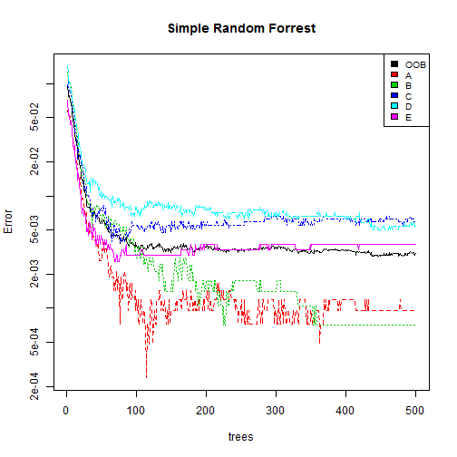

<!-- rmarkdown v1 -->
Activity Analysis
========================================================

## Executive Summary
The analysis is about classifying activities based on a number of factors. For the classification problem we will compare three algorithms:
1. Random Forest
2. Random Forest with Bagging
3. Random Forest after Dimension Rediuction
  
Dimension Reduction with Principal Component Analysis, dramatically reduces the complexity and reduces the execution time. However; the algorith compromises on the accuracy and interpretability.

1. Data used for training and testing - [Training](https://d396qusza40orc.cloudfront.net/predmachlearn/pml-training.csv)
2. Data for Prediction - [Validation](https://d396qusza40orc.cloudfront.net/predmachlearn/pml-testing.csv)

## Loading the Libraries
First, we will load all the required libraries needed. We would use **caret** and **party** package for the analysis.


```r
library(caret)
```

```
## Warning: package 'caret' was built under R version 3.1.1
```

```
## Loading required package: lattice
## Loading required package: ggplot2
```

```r
library(randomForest)
```

```
## Warning: package 'randomForest' was built under R version 3.1.1
```

```
## randomForest 4.6-10
## Type rfNews() to see new features/changes/bug fixes.
```

```r
library(party)
```

```
## Warning: package 'party' was built under R version 3.1.1
```

```
## Loading required package: grid
## Loading required package: zoo
## 
## Attaching package: 'zoo'
## 
## The following objects are masked from 'package:base':
## 
##     as.Date, as.Date.numeric
## 
## Loading required package: sandwich
```

```
## Warning: package 'sandwich' was built under R version 3.1.1
```

```
## Loading required package: strucchange
```

```
## Warning: package 'strucchange' was built under R version 3.1.1
```

```
## Loading required package: modeltools
```

```
## Warning: package 'modeltools' was built under R version 3.1.1
```

```
## Loading required package: stats4
```


## Importing the Datasets

```r
PML_Training<-read.csv("pml_training.csv",header=T)

PML_Testing<-read.csv("pml_testing.csv",header=T)
```
## Data Preprocessing
Through some preliminary analysis, we would first select the columns which are expected to influence the prediction.

We would store the index of these columns in a new variable **columns**

```r
columns<-which(names(PML_Training) %in% c("classe",
                                          "num_window",
                                          "roll_belt",
                                          "pitch_belt",
                                          "yaw_belt",
                                          "total_accel_belt",
                                          "gyros_belt_x",
                                          "gyros_belt_y",
                                          "gyros_belt_z",
                                          "accel_belt_x",
                                          "accel_belt_y",
                                          "accel_belt_z",
                                          "magnet_belt_x",
                                          "magnet_belt_y",
                                          "magnet_belt_z",
                                          "roll_arm",
                                          "pitch_arm",
                                          "yaw_arm",
                                          "total_accel_arm",
                                          "gyros_arm_x",
                                          "gyros_arm_y",
                                          "gyros_arm_z",
                                          "accel_arm_x",
                                          "accel_arm_y",
                                          "accel_arm_z",
                                          "magnet_arm_x",
                                          "magnet_arm_y",
                                          "magnet_arm_z",
                                          "roll_dumbbell",
                                          "pitch_dumbbell",
                                          "yaw_dumbbell"))
```
The columns use for the algorith are as follows:
7, 8, 9, 10, 11, 37, 38, 39, 40, 41, 42, 43, 44, 45, 46, 47, 48, 49, 60, 61, 62, 63, 64, 65, 66, 67, 68, 84, 85, 86, 160

We will then subset the training set and partition it into training and testing sets.

```r
PML_Training_Subset<-PML_Training[,columns]
```

Training set will contain 75% of the records and testing set will contain 25% of the records.

```r
inTrain<-createDataPartition(y=PML_Training_Subset$classe,p=0.75,list=FALSE)
training<-PML_Training_Subset[inTrain,]
testing<-PML_Training_Subset[-inTrain,]
```

## Simple Random Forrest
**Step 1: Training The Model**
We will first train the model on the training set using all the predictors. The output variable is **classe**

```r
r2 = randomForest(classe ~., data=training, importance=TRUE, do.trace=100)
```

```
## ntree      OOB      1      2      3      4      5
##   100:   0.43%  0.17%  0.53%  0.55%  0.62%  0.48%
##   200:   0.37%  0.19%  0.32%  0.55%  0.62%  0.33%
##   300:   0.37%  0.19%  0.28%  0.58%  0.58%  0.37%
##   400:   0.33%  0.12%  0.32%  0.55%  0.50%  0.33%
##   500:   0.29%  0.12%  0.28%  0.51%  0.41%  0.22%
```
**Step 2: FOt the Model on the Training Set:**

```r
pred2<-predict(r2,testing[,-31])
```
**Step 3: Building the Confusion Matrix to asses the accuracy of the Model**

```r
r2
```

```
## 
## Call:
##  randomForest(formula = classe ~ ., data = training, importance = TRUE,      do.trace = 100) 
##                Type of random forest: classification
##                      Number of trees: 500
## No. of variables tried at each split: 5
## 
##         OOB estimate of  error rate: 0.29%
## Confusion matrix:
##      A    B    C    D    E class.error
## A 4180    0    0    4    1    0.001195
## B    4 2840    2    2    0    0.002809
## C    1    8 2554    3    1    0.005064
## D    0    1    7 2402    2    0.004146
## E    0    0    2    4 2700    0.002217
```

```r
confusionMatrix(testing$classe,pred2)
```

```
## Warning: package 'e1071' was built under R version 3.1.1
```

```
## Confusion Matrix and Statistics
## 
##           Reference
## Prediction    A    B    C    D    E
##          A 1391    0    2    2    0
##          B    1  948    0    0    0
##          C    0    1  854    0    0
##          D    0    0    3  801    0
##          E    0    2    1    1  897
## 
## Overall Statistics
##                                         
##                Accuracy : 0.997         
##                  95% CI : (0.995, 0.999)
##     No Information Rate : 0.284         
##     P-Value [Acc > NIR] : <2e-16        
##                                         
##                   Kappa : 0.997         
##  Mcnemar's Test P-Value : NA            
## 
## Statistics by Class:
## 
##                      Class: A Class: B Class: C Class: D Class: E
## Sensitivity             0.999    0.997    0.993    0.996    1.000
## Specificity             0.999    1.000    1.000    0.999    0.999
## Pos Pred Value          0.997    0.999    0.999    0.996    0.996
## Neg Pred Value          1.000    0.999    0.999    0.999    1.000
## Prevalence              0.284    0.194    0.175    0.164    0.183
## Detection Rate          0.284    0.193    0.174    0.163    0.183
## Detection Prevalence    0.284    0.194    0.174    0.164    0.184
## Balanced Accuracy       0.999    0.998    0.996    0.998    1.000
```
OOB estimate of  error rate = 0.26%.
Accuracy of the model = 99.76%

**Plot of the Error Rate vs Number of Trees used**

```r
plot(r2, log="y",main="Simple Random Forrest")
legend("topright", colnames(r2$err.rate),col=1:6,cex=0.8,fill=1:6)
```

 
The above plot shows that classifying **Activity Type D** has highest error rate.

**Importance of Variables**

```r
VariableUsed<-varUsed(r2, by.tree=FALSE, count=TRUE)
Max_Imp=names(PML_Training_Subset)[which(VariableUsed==max(VariableUsed))]
Min_Imp=names(PML_Training_Subset)[which(VariableUsed==min(VariableUsed))]
```
Variable Used the most **num_window**
Variable used the least **total_accel_belt**

## Random Forrest with Bagging

```r
predictors<-PML_Training_Subset[,-31]
Classe<-PML_Training_Subset[,31]
treeBag<-bag(predictors,Classe,B=10,
             bagControl=bagControl(fit=ctreeBag$fit,
                                   predict=ctreeBag$pred,
                                   aggregate=ctreeBag$aggregate))


pred3<-predict(treeBag,testing[,-31])

confusionMatrix(testing$classe,pred3)
```

```
## Confusion Matrix and Statistics
## 
##           Reference
## Prediction    A    B    C    D    E
##          A 1372    1   10    8    4
##          B    3  927   10    6    3
##          C    2   17  828    7    1
##          D    2    7   17  778    0
##          E    1    3    3    1  893
## 
## Overall Statistics
##                                         
##                Accuracy : 0.978         
##                  95% CI : (0.974, 0.982)
##     No Information Rate : 0.281         
##     P-Value [Acc > NIR] : <2e-16        
##                                         
##                   Kappa : 0.973         
##  Mcnemar's Test P-Value : 0.0313        
## 
## Statistics by Class:
## 
##                      Class: A Class: B Class: C Class: D Class: E
## Sensitivity             0.994    0.971    0.954    0.973    0.991
## Specificity             0.993    0.994    0.993    0.994    0.998
## Pos Pred Value          0.984    0.977    0.968    0.968    0.991
## Neg Pred Value          0.998    0.993    0.990    0.995    0.998
## Prevalence              0.281    0.195    0.177    0.163    0.184
## Detection Rate          0.280    0.189    0.169    0.159    0.182
## Detection Prevalence    0.284    0.194    0.174    0.164    0.184
## Balanced Accuracy       0.994    0.983    0.974    0.983    0.995
```
Confusion Matrix of the bagged model shows accuracy of 98.06%

## Random Forrest with PCA
**Step 1:**
Create Principal Components and determine the number of components to be use

```r
prComp<-prcomp(training[,-31],center=T,scale=T)
```
We will now calculate Eigen Values and components with eigen value greater than one will be used.

```r
Eigen_Values=prComp$sdev^2
Eigen_Values
```

```
##  [1] 7.186020 4.922503 4.019677 2.058543 1.898590 1.613485 1.382171
##  [8] 1.183661 0.960786 0.834356 0.700876 0.642674 0.485395 0.364612
## [15] 0.318940 0.291876 0.268647 0.222609 0.169506 0.125948 0.084758
## [22] 0.060706 0.047691 0.037021 0.035104 0.031590 0.023184 0.020021
## [29] 0.006764 0.002291
```

```r
No_of_comp=sum(Eigen_Values>1)
```
Eigen Value calculation shows that we should use **8** components.

We will also create screeplot to see after how many components variance plot flattens


```r
screeplot(prComp,main="Scree Plot",xlab="Components")
```

 

```r
screeplot(prComp,type="line",main="Scree  Plot")
```

 
The Plot shows that after 10 components, variance flattens.

We will take the middle path and go with 9 components.

Varimax Rotation shows loading of different variables on these components

```r
summary(prComp)
```

```
## Importance of components:
##                         PC1   PC2   PC3    PC4    PC5    PC6    PC7    PC8
## Standard deviation     2.68 2.219 2.005 1.4348 1.3779 1.2702 1.1757 1.0880
## Proportion of Variance 0.24 0.164 0.134 0.0686 0.0633 0.0538 0.0461 0.0395
## Cumulative Proportion  0.24 0.404 0.538 0.6062 0.6695 0.7233 0.7694 0.8088
##                          PC9   PC10   PC11   PC12   PC13   PC14   PC15
## Standard deviation     0.980 0.9134 0.8372 0.8017 0.6967 0.6038 0.5647
## Proportion of Variance 0.032 0.0278 0.0234 0.0214 0.0162 0.0121 0.0106
## Cumulative Proportion  0.841 0.8687 0.8920 0.9134 0.9296 0.9418 0.9524
##                           PC16    PC17    PC18    PC19   PC20    PC21
## Standard deviation     0.54026 0.51831 0.47181 0.41171 0.3549 0.29113
## Proportion of Variance 0.00973 0.00895 0.00742 0.00565 0.0042 0.00283
## Cumulative Proportion  0.96214 0.97109 0.97851 0.98416 0.9884 0.99119
##                           PC22    PC23    PC24    PC25    PC26    PC27
## Standard deviation     0.24639 0.21838 0.19241 0.18736 0.17774 0.15226
## Proportion of Variance 0.00202 0.00159 0.00123 0.00117 0.00105 0.00077
## Cumulative Proportion  0.99321 0.99480 0.99603 0.99720 0.99826 0.99903
##                           PC28    PC29    PC30
## Standard deviation     0.14149 0.08224 0.04787
## Proportion of Variance 0.00067 0.00023 0.00008
## Cumulative Proportion  0.99970 0.99992 1.00000
```

```r
load = prComp$rotation
my.var=varimax(load)
my.var
```

```
## $loadings
## 
## Loadings:
##                  PC1 PC2 PC3 PC4 PC5 PC6 PC7 PC8 PC9 PC10 PC11 PC12 PC13
## num_window                                       -1                     
## roll_belt                                                               
## pitch_belt                                                              
## yaw_belt                                                                
## total_accel_belt                                                        
## gyros_belt_x                                                   -1       
## gyros_belt_y                                                            
## gyros_belt_z                                         -1                 
## accel_belt_x          1                                                 
## accel_belt_y                                                            
## accel_belt_z      1                                                     
## magnet_belt_x                                                           
## magnet_belt_y                    -1                                     
## magnet_belt_z                                                           
## roll_arm                                                                
## pitch_arm                                                           -1  
## yaw_arm                                                    1            
## total_accel_arm                      -1                                 
## gyros_arm_x                   1                                         
## gyros_arm_y                                                             
## gyros_arm_z                                                             
## accel_arm_x                                                             
## accel_arm_y                                                             
## accel_arm_z                                                             
## magnet_arm_x                                                            
## magnet_arm_y                                                            
## magnet_arm_z              1                                             
## roll_dumbbell                             1                             
## pitch_dumbbell                               -1                         
## yaw_dumbbell                                                            
##                  PC14 PC15 PC16 PC17 PC18 PC19 PC20 PC21 PC22 PC23 PC24
## num_window                                                             
## roll_belt                                                              
## pitch_belt                                                             
## yaw_belt                                                               
## total_accel_belt                                                       
## gyros_belt_x                                                           
## gyros_belt_y                               1                           
## gyros_belt_z                                                           
## accel_belt_x                                                           
## accel_belt_y                                                   1       
## accel_belt_z                                                           
## magnet_belt_x                                        1                 
## magnet_belt_y                                                          
## magnet_belt_z                         1                                
## roll_arm               1                                               
## pitch_arm                                                              
## yaw_arm                                                                
## total_accel_arm                                                        
## gyros_arm_x                                                            
## gyros_arm_y                                              -1            
## gyros_arm_z       1                                                    
## accel_arm_x                                                         1  
## accel_arm_y                                                            
## accel_arm_z                                                            
## magnet_arm_x               -1                                          
## magnet_arm_y                                    1                      
## magnet_arm_z                                                           
## roll_dumbbell                                                          
## pitch_dumbbell                                                         
## yaw_dumbbell                     1                                     
##                  PC25 PC26 PC27 PC28 PC29 PC30
## num_window                                    
## roll_belt                                  1  
## pitch_belt                 -1                 
## yaw_belt               1                      
## total_accel_belt                -1            
## gyros_belt_x                                  
## gyros_belt_y                                  
## gyros_belt_z                                  
## accel_belt_x                                  
## accel_belt_y                                  
## accel_belt_z                                  
## magnet_belt_x                                 
## magnet_belt_y                                 
## magnet_belt_z                                 
## roll_arm                                      
## pitch_arm                                     
## yaw_arm                                       
## total_accel_arm                               
## gyros_arm_x                                   
## gyros_arm_y                                   
## gyros_arm_z                                   
## accel_arm_x                                   
## accel_arm_y                          -1       
## accel_arm_z       1                           
## magnet_arm_x                                  
## magnet_arm_y                                  
## magnet_arm_z                                  
## roll_dumbbell                                 
## pitch_dumbbell                                
## yaw_dumbbell                                  
## 
##                  PC1   PC2   PC3   PC4   PC5   PC6   PC7   PC8   PC9  PC10
## SS loadings    1.000 1.000 1.000 1.000 1.000 1.000 1.000 1.000 1.000 1.000
## Proportion Var 0.033 0.033 0.033 0.033 0.033 0.033 0.033 0.033 0.033 0.033
## Cumulative Var 0.033 0.067 0.100 0.133 0.167 0.200 0.233 0.267 0.300 0.333
##                 PC11  PC12  PC13  PC14  PC15  PC16  PC17  PC18  PC19  PC20
## SS loadings    1.000 1.000 1.000 1.000 1.000 1.000 1.000 1.000 1.000 1.000
## Proportion Var 0.033 0.033 0.033 0.033 0.033 0.033 0.033 0.033 0.033 0.033
## Cumulative Var 0.367 0.400 0.433 0.467 0.500 0.533 0.567 0.600 0.633 0.667
##                 PC21  PC22  PC23  PC24  PC25  PC26  PC27  PC28  PC29  PC30
## SS loadings    1.000 1.000 1.000 1.000 1.000 1.000 1.000 1.000 1.000 1.000
## Proportion Var 0.033 0.033 0.033 0.033 0.033 0.033 0.033 0.033 0.033 0.033
## Cumulative Var 0.700 0.733 0.767 0.800 0.833 0.867 0.900 0.933 0.967 1.000
## 
## $rotmat
##            [,1]      [,2]      [,3]      [,4]     [,5]      [,6]      [,7]
##  [1,]  0.333497 -0.203240  0.014184 -0.049542 -0.04460 -0.113344 -0.014689
##  [2,]  0.160815  0.293848  0.135957  0.051349 -0.16804 -0.041633  0.172069
##  [3,] -0.107699 -0.111221  0.436573 -0.017732  0.05671  0.121456 -0.111188
##  [4,]  0.030333 -0.239017  0.006359  0.477514 -0.30613 -0.067262 -0.039088
##  [5,]  0.007644  0.138087  0.002853  0.467742  0.41419 -0.001900 -0.075448
##  [6,]  0.070909  0.063655  0.189167  0.097167 -0.20589  0.566416  0.282105
##  [7,]  0.012081  0.070388 -0.124955  0.098060 -0.18905 -0.305740  0.339011
##  [8,]  0.005985  0.026141 -0.061335  0.045842 -0.21493  0.024601 -0.469481
##  [9,]  0.023977 -0.028287  0.041088  0.069402  0.09683  0.145490 -0.048418
## [10,]  0.035507 -0.004255  0.025383  0.051302  0.20506  0.144340  0.119678
## [11,] -0.014424 -0.053527  0.024260 -0.035214  0.03277  0.043617  0.029436
## [12,] -0.046671 -0.024204 -0.083764  0.063311 -0.03052 -0.175306  0.429716
## [13,] -0.014623  0.169509  0.040511  0.053102 -0.07859 -0.076291 -0.217413
## [14,]  0.025421 -0.072854  0.032533 -0.174966  0.02753  0.043008  0.221936
## [15,] -0.116915 -0.192436 -0.071413  0.072371  0.09764  0.088557  0.358854
## [16,]  0.018528  0.022984 -0.080763  0.072806 -0.23385  0.441944 -0.129972
## [17,]  0.024465  0.057357 -0.106104  0.009236  0.11784  0.411666  0.220110
## [18,] -0.026054 -0.114177 -0.136148 -0.035388  0.38824  0.190871 -0.156520
## [19,]  0.058305 -0.053810  0.035241  0.044305  0.41027 -0.071115 -0.023061
## [20,]  0.072339 -0.088983 -0.336537 -0.014045 -0.18754  0.223541 -0.120051
## [21,]  0.087538 -0.118189  0.377315  0.095706 -0.17697 -0.062999  0.024830
## [22,] -0.041420 -0.048014 -0.096778 -0.581572 -0.10580  0.014307 -0.005013
## [23,] -0.004045  0.520903 -0.102560 -0.027517  0.12162  0.007381  0.020525
## [24,]  0.088631  0.062429  0.208180 -0.338069  0.08930  0.007195  0.015785
## [25,]  0.123617 -0.199729 -0.352891  0.001824  0.02343  0.014219  0.037799
## [26,]  0.107860 -0.269788  0.312789 -0.027100  0.07255  0.003490  0.009316
## [27,]  0.085762 -0.465912 -0.005257 -0.036279  0.08644 -0.009460 -0.010020
## [28,] -0.332145 -0.219115 -0.274584  0.040060 -0.02082 -0.003270  0.016665
## [29,]  0.510656  0.042472 -0.251709  0.018138  0.01221 -0.015635 -0.012994
## [30,]  0.627309 -0.001655  0.014738 -0.006749  0.07160  0.001204  0.004591
##            [,8]      [,9]     [,10]      [,11]     [,12]      [,13]
##  [1,] -0.015073  0.056656 -0.117332  0.1198391  0.052490  0.0149443
##  [2,]  0.213441 -0.084681 -0.214522 -0.0592654 -0.281942 -0.1559372
##  [3,]  0.002531  0.033138  0.109650  0.0317976  0.153076 -0.2970301
##  [4,]  0.064141 -0.137182 -0.084318 -0.1597908 -0.020362  0.0382365
##  [5,] -0.083276  0.096365 -0.071438  0.2614601 -0.001699 -0.0316460
##  [6,] -0.213158 -0.028138  0.008702  0.1353338  0.025706  0.1096096
##  [7,] -0.192908  0.291089  0.446338 -0.0579030  0.227608 -0.2005365
##  [8,]  0.613454 -0.049324  0.107634  0.2346813  0.265631 -0.0226950
##  [9,]  0.184780  0.721675 -0.173763 -0.4548803  0.073308 -0.0333862
## [10,]  0.190475 -0.433188  0.397040 -0.3272084 -0.111994  0.0968717
## [11,]  0.064624  0.342397  0.200226  0.5474866 -0.262577  0.4695011
## [12,]  0.059405 -0.151581 -0.255251  0.2221998  0.469995  0.1041479
## [13,] -0.140150 -0.035256 -0.009410 -0.3273267  0.178985  0.7187696
## [14,]  0.145279  0.029648  0.015926 -0.1414592  0.324620  0.2023423
## [15,]  0.280293  0.062190 -0.001850 -0.0830602 -0.344752  0.1229644
## [16,] -0.234215  0.029310  0.236303  0.0502383  0.160808 -0.0639897
## [17,]  0.365950  0.011175 -0.082253  0.0373942  0.244909 -0.0318197
## [18,] -0.283026 -0.116154 -0.336037 -0.0228436  0.161392 -0.0230535
## [19,]  0.044542 -0.003250  0.466010 -0.0104827  0.187854 -0.0070936
## [20,] -0.101569  0.032868  0.118293 -0.0869879 -0.139742 -0.0666426
## [21,] -0.023389  0.009779 -0.023355  0.0150481  0.089163  0.0717897
## [22,] -0.020261  0.023565 -0.035736  0.0249357  0.079479 -0.0228704
## [23,]  0.046357  0.021643 -0.005809  0.0049073  0.024499 -0.0111597
## [24,]  0.035713 -0.025385  0.046127 -0.0149151 -0.138972  0.0299112
## [25,]  0.018582 -0.015140  0.003797  0.0049388 -0.046000 -0.0001554
## [26,] -0.006065 -0.008736 -0.013673 -0.0058818  0.044692  0.0088947
## [27,]  0.011132 -0.006574  0.013261  0.0061387 -0.034933  0.0250038
## [28,]  0.025507 -0.010429 -0.023019  0.0033714 -0.006714 -0.0013221
## [29,] -0.003961 -0.001082  0.009848  0.0022052  0.022561  0.0039371
## [30,]  0.002979 -0.001072 -0.001643  0.0006984  0.008957  0.0029402
##           [,14]      [,15]     [,16]     [,17]    [,18]      [,19]
##  [1,] -0.259015  0.1718081  0.068506  0.083856 -0.01838 -0.2283113
##  [2,]  0.051494 -0.1031138  0.159924 -0.343636  0.16529  0.1309111
##  [3,] -0.052414 -0.0342652  0.345898  0.079042 -0.05130 -0.0526563
##  [4,]  0.238443 -0.1806775  0.040923  0.087353  0.30406  0.0803624
##  [5,]  0.103449  0.2780150  0.052293  0.004600 -0.40139 -0.0506653
##  [6,] -0.061457  0.1458582 -0.353245  0.023682  0.21100 -0.0443285
##  [7,] -0.041589  0.0865190  0.118458 -0.028006  0.21339 -0.3862480
##  [8,] -0.112735  0.1680140 -0.117153 -0.224906  0.11344 -0.1585485
##  [9,] -0.088482 -0.2591628 -0.143680 -0.144949 -0.10972  0.0028821
## [10,] -0.027781 -0.3179043 -0.093769 -0.144057 -0.28328 -0.4065314
## [11,]  0.172418 -0.3679589  0.066576 -0.091385  0.08642 -0.1274214
## [12,] -0.261451 -0.3233281 -0.023445 -0.191466 -0.22955  0.2232423
## [13,] -0.232479  0.1196930  0.202402  0.128910  0.03502  0.0097272
## [14,]  0.701047  0.3521958  0.038644 -0.233519 -0.08441  0.0431286
## [15,] -0.376984  0.4733981  0.105119 -0.191444  0.07056  0.0376007
## [16,] -0.140963 -0.0078838  0.245873 -0.383788 -0.20374  0.1722151
## [17,]  0.009149 -0.0953333  0.274881  0.564633  0.10801 -0.0715046
## [18,]  0.006320 -0.0799893  0.105899 -0.355387  0.43412 -0.3137798
## [19,] -0.110893 -0.0299316 -0.121257 -0.034765  0.34612  0.5475987
## [20,]  0.081990 -0.0059697 -0.003870  0.103948 -0.16382  0.2258174
## [21,] -0.021289 -0.0077964  0.141226 -0.070382 -0.14055 -0.0336424
## [22,] -0.077584 -0.0003506 -0.133634  0.012512 -0.07513 -0.0437197
## [23,] -0.005810  0.0129869 -0.092774 -0.004408  0.13015 -0.0228175
## [24,] -0.003987 -0.0070545  0.341952 -0.029834  0.02075  0.1255212
## [25,]  0.030937 -0.0615198  0.349991 -0.053611  0.00555  0.0349888
## [26,] -0.029729  0.0160110 -0.361877  0.030100 -0.02450 -0.0178205
## [27,]  0.004655 -0.0052746  0.029673 -0.001477  0.02936  0.0401628
## [28,]  0.004061  0.0145379 -0.111595  0.003662 -0.04834 -0.0365087
## [29,]  0.002823  0.0050078 -0.114537  0.015634 -0.10952  0.0006908
## [30,] -0.001561  0.0068925 -0.004517  0.002384  0.02404 -0.0060171
##           [,20]     [,21]     [,22]      [,23]     [,24]     [,25]
##  [1,]  0.039111 -0.224316 -0.122890 -0.2853699 -0.062066 -0.095165
##  [2,]  0.147432  0.263740  0.018518 -0.2264034 -0.312616 -0.054519
##  [3,]  0.436814 -0.070666 -0.026204  0.1361632 -0.267813  0.382981
##  [4,]  0.065330 -0.227145  0.464286  0.0649057 -0.037003 -0.066857
##  [5,]  0.006126  0.132506  0.435228 -0.0808589 -0.008482 -0.036042
##  [6,] -0.030526  0.032864  0.111018 -0.0700689  0.187424  0.369943
##  [7,]  0.097733  0.130201  0.112649 -0.0008304  0.083024 -0.118565
##  [8,]  0.016913  0.081411  0.053711  0.0188051  0.194123  0.044993
##  [9,] -0.045734 -0.039819  0.058342 -0.0493648  0.098845  0.090507
## [10,] -0.010359  0.001346  0.060172 -0.0559817  0.012046  0.018203
## [11,]  0.111214  0.004764 -0.027653  0.0096395 -0.121069 -0.039721
## [12,]  0.173447 -0.031499  0.028928  0.0493135  0.150840  0.005313
## [13,]  0.154346  0.088159  0.044989 -0.0293192 -0.132973  0.039817
## [14,]  0.060013 -0.079082 -0.104266 -0.0377548 -0.052144  0.003292
## [15,]  0.073188 -0.018824  0.034875  0.1645788 -0.071636 -0.063445
## [16,] -0.107297 -0.283985 -0.006570 -0.0278008 -0.183140 -0.300046
## [17,] -0.068566  0.120992 -0.026516 -0.0694756 -0.095704 -0.256301
## [18,]  0.092199  0.206417 -0.008119  0.0152769  0.054243 -0.115563
## [19,] -0.087206  0.146599  0.032985 -0.1570112 -0.102895  0.050099
## [20,]  0.394205  0.420426 -0.059353  0.1363198  0.202229 -0.212347
## [21,] -0.302819  0.570899 -0.082083  0.2889594  0.062161  0.036290
## [22,] -0.110101  0.158240  0.638169  0.0058660 -0.357514  0.011378
## [23,]  0.131550 -0.217847  0.015752  0.6416020 -0.051441 -0.007499
## [24,]  0.195031 -0.115877  0.322404 -0.0773747  0.624098 -0.041500
## [25,] -0.382162 -0.027640  0.031851  0.2933424 -0.027523  0.359958
## [26,]  0.151611 -0.019194  0.011658  0.2956884 -0.146601 -0.429578
## [27,]  0.070308 -0.055474  0.035190  0.2061850  0.062547  0.027870
## [28,]  0.299644  0.080723 -0.045632 -0.1683528 -0.090969  0.211032
## [29,]  0.287596  0.057025 -0.011439  0.0236347 -0.131284  0.295395
## [30,] -0.008050 -0.048623  0.005625  0.0121574 -0.008313 -0.016225
##           [,26]      [,27]     [,28]      [,29]      [,30]
##  [1,] -0.344485 -0.1887695  0.327638 -0.3056086 -0.3436359
##  [2,]  0.076868  0.3027675  0.153405 -0.1321443 -0.1321012
##  [3,]  0.009146 -0.1087446 -0.112145 -0.1615756  0.0987733
##  [4,] -0.136043 -0.2379964 -0.004177  0.0457229 -0.0148039
##  [5,]  0.015567  0.1100532  0.055017 -0.0896955 -0.0369076
##  [6,]  0.027671  0.0979604  0.061411 -0.1421581 -0.0561122
##  [7,]  0.112073  0.1304646 -0.020238 -0.0005352  0.0097281
##  [8,]  0.085917  0.0646895 -0.036777 -0.0569021  0.0210161
##  [9,] -0.029389 -0.0108003  0.029321 -0.0423835 -0.0293745
## [10,] -0.097608 -0.0307196  0.033361 -0.0972751 -0.0489145
## [11,] -0.026245 -0.0844575 -0.034670 -0.0162818  0.0158377
## [12,] -0.005572 -0.0253849 -0.094317 -0.1201209  0.0579150
## [13,]  0.121451  0.1676520  0.010117 -0.0789651  0.0180607
## [14,] -0.067724 -0.0675712  0.011398 -0.0769110 -0.0366553
## [15,] -0.034243 -0.2167980 -0.194855  0.0845457  0.1128075
## [16,] -0.011454  0.0469844  0.079551  0.2280290 -0.0179337
## [17,]  0.029982  0.0720551  0.026309  0.1461940 -0.0395917
## [18,] -0.016033 -0.1224265 -0.079693  0.0324265  0.0003206
## [19,] -0.106292 -0.0940761  0.110396 -0.0519170 -0.1012358
## [20,] -0.128285 -0.1216172 -0.041221 -0.3851089 -0.0005235
## [21,] -0.252036 -0.1762742  0.205277  0.2778703 -0.0560079
## [22,] -0.124823 -0.0536841 -0.041292 -0.0364646  0.0420633
## [23,] -0.309394  0.0107630  0.297800 -0.0159518 -0.0909205
## [24,]  0.133957 -0.0428472  0.216558  0.1846833 -0.1019321
## [25,]  0.403224 -0.0002956  0.218676 -0.3118182 -0.1103397
## [26,]  0.543969  0.0120204  0.212267 -0.0511428 -0.1210248
## [27,] -0.317882  0.7545409 -0.116440  0.0808697 -0.1182933
## [28,]  0.015913  0.0464152  0.652317  0.3069827  0.2110273
## [29,]  0.145110 -0.1344423 -0.220499  0.4950879 -0.3509040
## [30,] -0.039937  0.0341099  0.102173 -0.0115739  0.7642009
```
Cumulative variance equals 1, if we use al the 30 components. However, we decide to use 9 components.

**Step 2: Pre-processing to Compute Components**

```r
preProc<-preProcess(training[,-31],method="pca",pcaComp=9)
```

**Step 3: Train the PCA Model on Train set and apply on Test set**

```r
trainPC<-predict(preProc,training[,-31])
testPC<-predict(preProc,testing[,-31])
```

**Step 4: Fit Random Forest on trainPC**

```r
r = randomForest(training$classe ~., data=trainPC, importance=TRUE, do.trace=100)
```

```
## ntree      OOB      1      2      3      4      5
##   100:   8.18%  6.57% 10.43%  8.41% 12.23%  4.47%
##   200:   7.76%  6.40%  9.87%  8.34% 11.32%  3.92%
##   300:   7.59%  6.26%  9.76%  8.10% 10.90%  3.92%
##   400:   7.61%  6.36%  9.76%  8.02% 11.24%  3.66%
##   500:   7.53%  6.38%  9.52%  7.91% 10.99%  3.77%
```

**Step 5: Fit the trained model on training set**

```r
pred<-predict(r,testPC)
```
We will now construct the Confusion Matrix to assess the accuracy of the Model

```r
confusionMatrix(testing$classe,pred)
```

```
## Confusion Matrix and Statistics
## 
##           Reference
## Prediction    A    B    C    D    E
##          A 1306   35   27   19    8
##          B   45  854   38    5    7
##          C   20   31  790   10    4
##          D    6   26   45  717   10
##          E    3   20   10   18  850
## 
## Overall Statistics
##                                         
##                Accuracy : 0.921         
##                  95% CI : (0.913, 0.928)
##     No Information Rate : 0.281         
##     P-Value [Acc > NIR] : < 2e-16       
##                                         
##                   Kappa : 0.9           
##  Mcnemar's Test P-Value : 4.22e-09      
## 
## Statistics by Class:
## 
##                      Class: A Class: B Class: C Class: D Class: E
## Sensitivity             0.946    0.884    0.868    0.932    0.967
## Specificity             0.975    0.976    0.984    0.979    0.987
## Pos Pred Value          0.936    0.900    0.924    0.892    0.943
## Neg Pred Value          0.979    0.972    0.970    0.987    0.993
## Prevalence              0.281    0.197    0.186    0.157    0.179
## Detection Rate          0.266    0.174    0.161    0.146    0.173
## Detection Prevalence    0.284    0.194    0.174    0.164    0.184
## Balanced Accuracy       0.961    0.930    0.926    0.956    0.977
```

```r
r
```

```
## 
## Call:
##  randomForest(formula = training$classe ~ ., data = trainPC, importance = TRUE,      do.trace = 100) 
##                Type of random forest: classification
##                      Number of trees: 500
## No. of variables tried at each split: 3
## 
##         OOB estimate of  error rate: 7.53%
## Confusion matrix:
##      A    B    C    D    E class.error
## A 3918  128   59   59   21     0.06380
## B  117 2577  101   37   16     0.09515
## C   62   81 2364   50   10     0.07908
## D   29   66  138 2147   32     0.10987
## E    8   32   23   39 2604     0.03769
```
Accuracy of the Model = 92.31%
OOB estimate of  error rate = 7.37%


**Plot of the Error Rate vs Number of Trees used**

```r
plot(r, log="y",main="Random Forrest with PCA")
legend("topright", colnames(r$err.rate),col=1:6,cex=0.8,fill=1:6)
```

 
The above plot shows that classifying **Activity Type D** has highest error rate.

**Importance of Variables**

```r
VariableUsedPCA<-varUsed(r, by.tree=FALSE, count=TRUE)
Max_ImpPCA=names(testPC)[which(VariableUsedPCA==max(VariableUsedPCA))]
Min_ImpPCA=names(testPC)[which(VariableUsedPCA==min(VariableUsedPCA))]
```
Component Used the most **PC9**
Component used the least **PC6**

## Model Selection and Prediction
Since, Simple Random Forest gives us the highest accuracy, we will use this model to classify the activities in the Second Dataset.

**Step 1: Subset the Dataset to be predicted**

```r
columns_PML_TEST<-which(names(PML_Testing) %in% c("num_window",
                                          "roll_belt",
                                          "pitch_belt",
                                          "yaw_belt",
                                          "total_accel_belt",
                                          "gyros_belt_x",
                                          "gyros_belt_y",
                                          "gyros_belt_z",
                                          "accel_belt_x",
                                          "accel_belt_y",
                                          "accel_belt_z",
                                          "magnet_belt_x",
                                          "magnet_belt_y",
                                          "magnet_belt_z",
                                          "roll_arm",
                                          "pitch_arm",
                                          "yaw_arm",
                                          "total_accel_arm",
                                          "gyros_arm_x",
                                          "gyros_arm_y",
                                          "gyros_arm_z",
                                          "accel_arm_x",
                                          "accel_arm_y",
                                          "accel_arm_z",
                                          "magnet_arm_x",
                                          "magnet_arm_y",
                                          "magnet_arm_z",
                                          "roll_dumbbell",
                                          "pitch_dumbbell",
                                          "yaw_dumbbell"))
```

**Step 2: Predict Activities based on Simple Random Forest Model**

```r
pred_rf<-predict(r2,PML_Testing[,columns_PML_TEST])
```


Just for comparison, we will compare predictions of all the models

```r
predictPC<-predict(preProc,PML_Testing[,columns_PML_TEST])

pred_rf_pca<-predict(r,predictPC)

pred_treeBag<-predict(treeBag,PML_Testing[,columns_PML_TEST])

Combined_Prediction_DS=data.frame(RandomForest=pred_rf,RF_PCA=pred_rf_pca,TreeBag=pred_treeBag)

Combined_Prediction_DS
```

```
##    RandomForest RF_PCA TreeBag
## 1             B      B       B
## 2             A      C       A
## 3             B      C       B
## 4             A      A       A
## 5             A      A       A
## 6             E      D       D
## 7             D      D       D
## 8             B      B       B
## 9             A      A       A
## 10            A      A       A
## 11            B      B       B
## 12            C      C       C
## 13            B      B       B
## 14            A      A       A
## 15            E      E       E
## 16            E      E       E
## 17            A      A       A
## 18            B      B       B
## 19            B      B       B
## 20            B      B       B
```

## Conclusion
Random Forest with PCA gives a different value for only Third Prediction.
